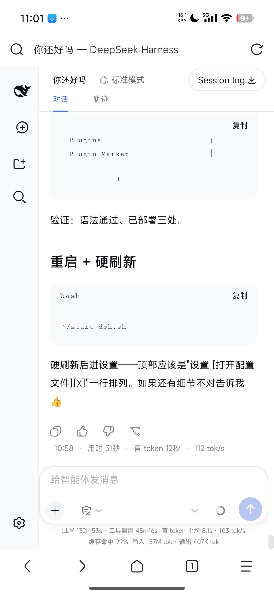
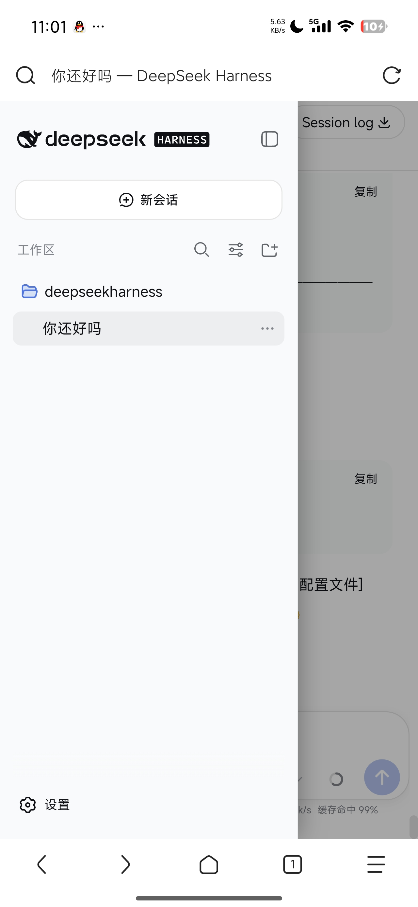
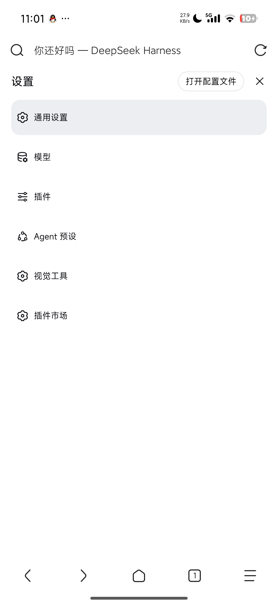
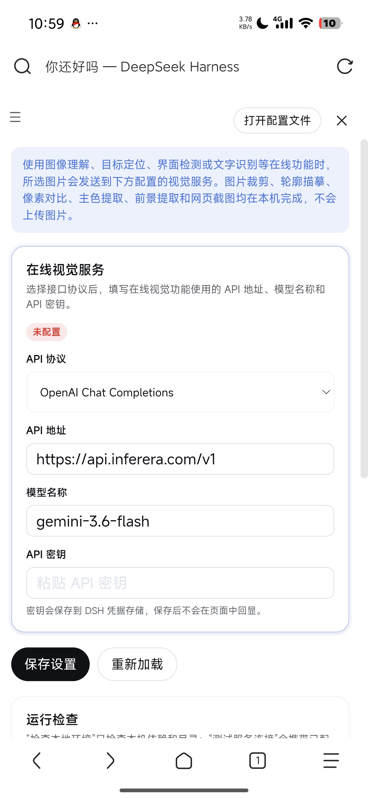

# dsh-mobile-css
[](https://github.com/awesome-dsh-plugin/awesome-dsh-plugin) [](https://github.com/deepseek-ai/deepseek-harness) [](LICENSE) [](https://github.com/ook826092-cloud/dsh-mobile-css) [](https://github.com/awesome-dsh-plugin/awesome-dsh-plugin)

**DeepSeek Harness（DSH）Web UI 移动端适配插件** —— 让你的 DSH 在手机上真正好用起来！

[English](README.en.md) | [GitHub](https://github.com/ook826092-cloud/dsh-mobile-css)

> 纯 CSS 注入 + 两个轻量辅助脚本，**零依赖、零源码修改、随时可卸载**。
> 通过官方 `WebServer.tapIndex()` 钩子注入，桌面端完全不受影响。

---

## ✨ 特色功能

### 📱 界面整体优化
- **紧凑字号体系**：针对手机屏幕调整字体大小层级，信息密度更高、一屏装更多内容，同时保证可读性
- **移动端字体栈**：优先使用手机系统的优质字体（小米 MiSans / 鸿蒙 HarmonyOS Sans / Roboto 等），观感更自然
- **安全触控目标**：独立控件 ≥44px，不再误触；输入框防安卓聚焦自动缩放

### 🖥️ 输入区（Composer）
- **输入卡全宽贴边**：充分利用屏幕宽度
- **光标对齐修复**：透明输入层与镜像文字层字号严格一致，光标不再错位
- **模型名智能隐藏**：只显示 v 形箭头，点击仍可切换模型，不再挤占权限开关
- **发送按钮贴右**：按钮永远停在右下角

### 🗂️ 侧边栏抽屉式
- 展开时**覆盖**主界面（带遮罩 + 阴影），主界面不再被挤压变形
- **点击遮罩即可关闭**，交互跟手机 App 一致
- 收起时保留小图标条（rail）

### ⚙️ 设置页两页式
- **手机标准交互**：全屏菜单页 → 点击选项跳转全屏内容页 → ☰ 返回
- 标题与按钮同级布局、顶部留白紧凑
- 长标签自动换行、表单/表格/图片防溢出

### 💬 消息区
- 用户消息气泡**占满整行**，不再又高又窄
- 消息底部操作条（复制/点赞/分支/统计）**换行完整显示**，统计单行紧凑
- 工具调用摘要允许换行，不再被省略号截断

### 📊 统计行
- 只保留有用信息，**固定两行**（耗时+速度 / 缓存+Token），行数不随内容跳变

### 📋 Markdown 表格
- 长单元格内容（如工具名）**自动换行**，不再盖住相邻列

---

## 📦 安装教程

### 方式一：从 GitHub 一键安装（推荐）

```sh
dsh plugin --profile web add github:ook826092-cloud/dsh-mobile-css
```

### 方式二：从 npm 安装

```sh
dsh plugin --profile web add dsh-mobile-css
```

### 方式三：手动 patch（不经过包管理器）

将以下内容加入你的 profile patch（`~/.dsh/profiles/web/cordis.patch.yml`）：

```yaml
- insert:
    - id: dsh-mobile-css
      name: "dsh-mobile-css"
```

然后安装依赖并启动：

```sh
cd ~/.dsh/profiles/web
pnpm add dsh-mobile-css
dsh web
```

### 安装后

1. **重启 `dsh web`**
2. 浏览器**硬刷新**（清除缓存或隐私窗口）
3. 打开 DSH Web UI，在手机上感受移动端适配效果

### 卸载

删除 patch 中的 `dsh-mobile-css` 条目，重启 `dsh web` 即可完全移除。插件只注入 CSS 和两个事件监听脚本，**不留任何残留**。

---

## 📸 实机效果

| | |
|---|---|
|  |  |
|  |  |

*截图来自 Android 真机实拍。*

---

## 🛡️ 兼容性与通用性

- **触发条件**：`pointer: coarse`（触屏）或视口 ≤1024px —— 适用于几乎所有现代 Android / iOS 手机，桌面端（鼠标 + 宽屏）完全不受影响
- **不依赖具体机型**：不写死任何设备型号、分辨率、像素密度；所有尺寸通过媒体查询和相对单位自适应
- **浏览器要求**：现代 Chrome / 系统浏览器（基于 Chromium 的安卓浏览器均支持；`:has()` 选择器需要 Chrome 105+，安卓手机浏览器均为 Chromium 内核，均满足）
- **前端版本**：插件按 DSH Web 前端的 CSS Modules 类名选择器编写；**DSH 升级后如个别选择器失效，复查对应类名即可**（这是所有 CSS 类插件共有的特性，非插件缺陷）。v1.1.0 已针对 **dsh-v0.1.0-rc.7** 实测校准（shell 资源 + 全部 client 插件包逐一核对）
- **安全**：纯 CSS + 两个事件监听脚本（遮罩关闭抽屉、设置导航收起），**无网络请求、无凭证访问、无文件系统操作**

---

## 📜 协议

[MIT License](LICENSE)
